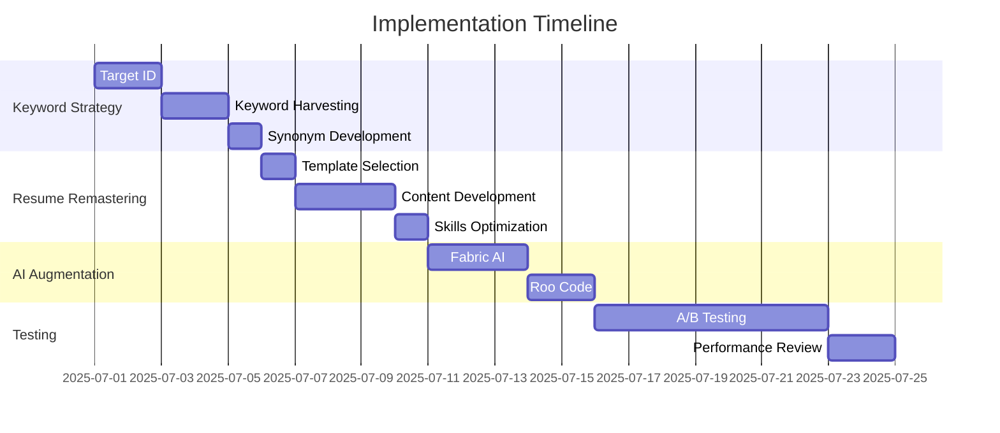

# FOD ATS Playbook Implementation Plan

## Phase 1: Keyword Strategy (Week 1)
1. **Target Identification** (Day 1-2)
   - Select 3 target job positions
   - Collect 5 job descriptions for each position
2. **Keyword Harvesting** (Day 3-4)
   - Extract key skills, tools, and responsibilities
   - Create master keyword list using Wordle
3. **Synonym Development** (Day 5)
   - Research alternative terms for each keyword
   - Build synonym bank

## Phase 2: Resume Remastering (Week 2)
1. **Template Selection** (Day 1)
   - Choose ATS-friendly template from Canva
2. **Content Development** (Day 2-4)
   - Draft executive summary with top keywords
   - Rewrite experience bullets using action verbs
   - Quantify achievements (add metrics)
3. **Skills Section Optimization** (Day 5)
   - Organize skills by category
   - Integrate keyword synonyms

## Phase 3: AI Augmentation (Week 3)
1. **Fabric AI Implementation** (Day 1-3)
   - Rewrite 5 key bullet points
   - Generate 3 executive summary variations
2. **Roo Code Setup** (Day 4-5)
   - Create keyword extraction script
   - Build resume scoring system

## Phase 4: Tool Integration (Ongoing)
- Install and configure:
  - Grammarly (daily use)
  - Jobscan (pre-submission check)
  - Canva (visual formatting)

## Phase 5: Testing & Iteration (Continuous)
1. **A/B Testing** (Weekly)
   - Create 2 resume variants
   - Track application response rates
2. **Performance Review** (Bi-weekly)
   - Analyze which versions get interviews
   - Adjust keyword strategy accordingly

## Timeline

## Resources Needed (Agent-Powered)
- **Figma**: For advanced resume design (free for individuals)
- **AI Grammar Agents**: Our internal agents for proofreading and style optimization
- **Agent Zero**: For automated keyword extraction and analysis
- **Rovodev**: For technical resume scoring and ATS simulation
- **Fabric AI**: For content enhancement and rewriting
- **OpenHands**: For cross-referencing job descriptions
- **Custom Agents**: For specialized ATS optimization tasks
